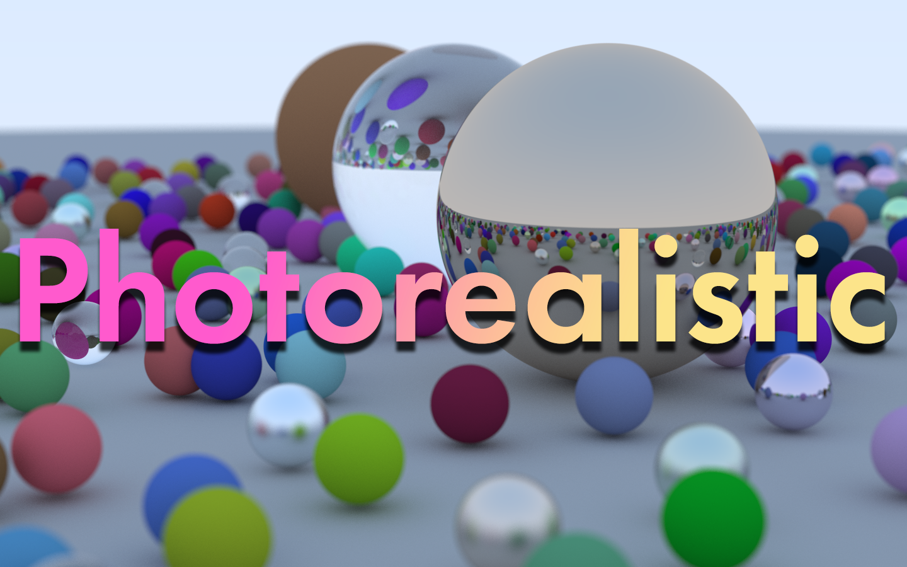

# About
Photorealistic is a low-dependency Ray Tracing Engine to generate photorealistic images.

# Dependencies

You will need [SDL2](http://www.libsdl.org):
```shell
Linux:
    apt-get install libsdl2-dev
Mac OS X:
    brew install sdl2
MSYS2:
    pacman -S mingw-w64-i686-SDL2
```

You will also need [SDL Image](https://www.libsdl.org/projects/SDL_image/):
```shell
Linux:
    apt-get install libsdl2-image-dev
macOS:
    brew install sdl_image
MSYS2:
    pacman -S mingw-w64-i686-SDL2_image
```

Yup, those are the two dependencies, the rest are built with the project.

# Notes
- To use the tools (found in the tools direcotry) you may need to run:
```sh
chmod +x tools/*.sh
```
# Credits
* [_libSDL_](https://libsdl.org) 
for [SDL_Image](https://www.libsdl.org/projects/SDL_image/) 
and [SDL2](http://www.libsdl.org)
* [_imgui_](https://github.com/ocornut/imgui) 
for the gui library
* [_Ray Tracing in One Weekend_](https://raytracing.github.io/books/RayTracingInOneWeekend.html) 
for majority of the [core](src/core)
